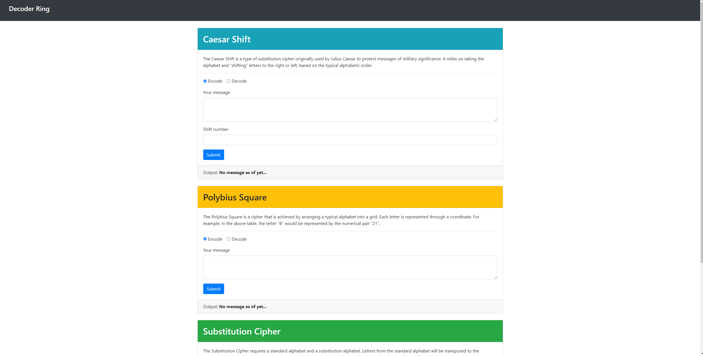
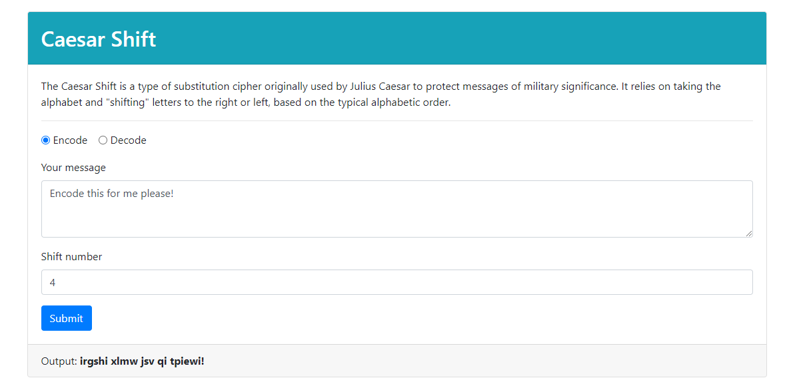
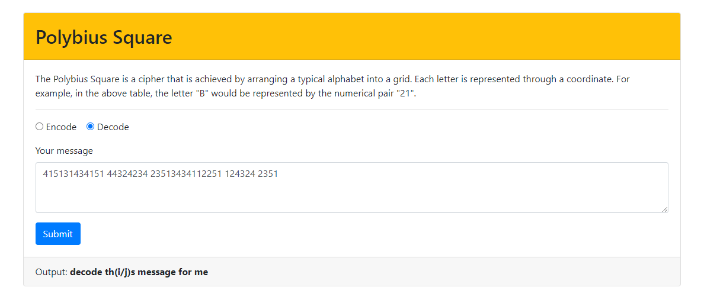
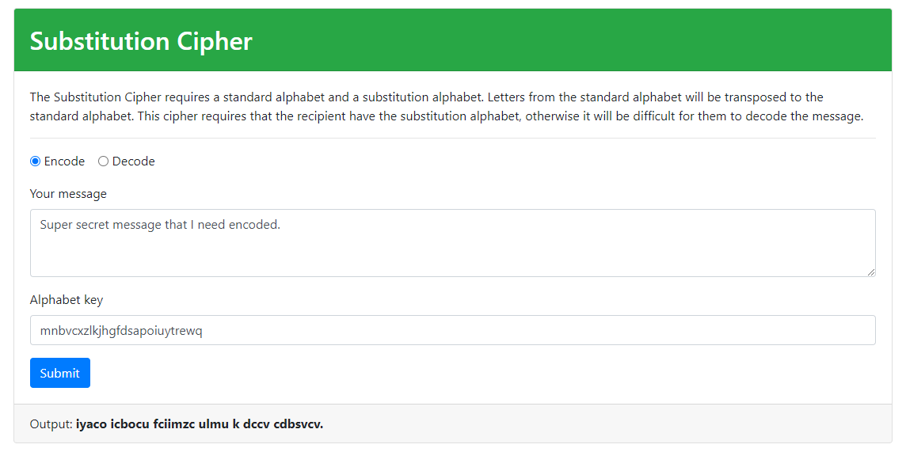

# About decoder-ring-project
This project was created as the first capstone during the Thinkful Engineering Immersion program. 
A user should be able to enter a message into any of three ciphers (Caesar Shift, Polybius Square and Alphabet Substitution) and recieve an encoded message in return 
OR enter an already encoded message and recieve a decoded message. 

## Project Preview
Main application view.

Example of an encoded message using the Caesar Shift.

A decoded message using the Polybius Cipher.

An encoded message after providing a substitution alphabet in the Substitution Cipher.

## Technology and Tools
* JavaScript
* HTML
* Bootstrap
* Mocha as a testing framework with Node
* Chai assertion library in conjuction with Mocha
* NYC as a coverage tool for unit testing
